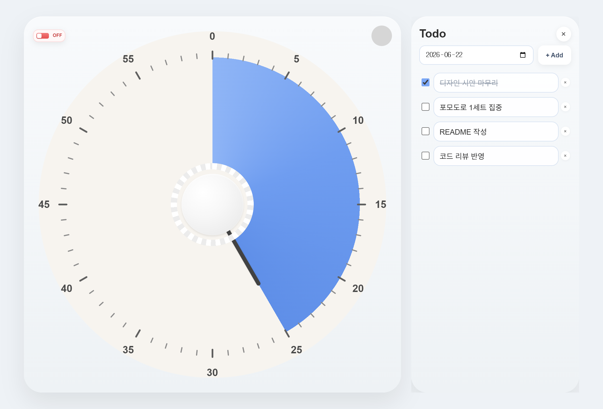

# Pomodoro Timer

다이얼(아날로그 키친 타이머) 방식으로 시간을 설정하는 데스크톱 포모도로 타이머입니다. 화면 한쪽에 작게 띄워두고 집중 시간을 관리할 수 있도록 만든 [Electron](https://www.electronjs.org/) 앱입니다.



## 목적

흔히 쓰는 "분 단위 입력" 방식 대신, 실제 주방용 다이얼 타이머처럼 **원을 돌려서 직관적으로 시간을 맞추는** 경험을 데스크톱에서 그대로 재현하는 것을 목표로 합니다. 항상 위에 떠 있는 작은 창으로 작업을 방해하지 않으면서, 옆에 간단한 할 일 목록까지 함께 관리할 수 있습니다.

## 주요 기능

### ⏱️ 다이얼 타이머

- **드래그로 시간 설정**: 다이얼을 마우스로 돌려 1~60분 사이로 설정합니다. 채워진 파란색 영역과 바늘이 남은 시간을 보여줍니다.
- **시작/일시정지 토글**: 좌측 상단 스위치(ON/OFF)로 타이머를 시작하거나 멈춥니다.
- **실행 중 시간 조절**: 타이머가 돌아가는 중에도 다이얼을 돌려 남은 시간을 바로 바꿀 수 있습니다.
- **종료 알림 램프**: 시간이 0이 되면 우측 상단 상태등이 빨간색으로 깜빡여 종료를 알립니다.
- **리셋**: 마지막으로 설정한 시간으로 되돌립니다.

### ✅ 날짜별 To-Do 목록

- 타이머 옆에 펼쳐지는 패널에서 할 일을 추가/수정/삭제하고 완료 체크할 수 있습니다.
- **날짜별로 분리 저장**되어, 날짜를 바꾸면 해당 날짜의 목록이 표시됩니다.
- 입력 내용과 패널 열림 상태, 선택한 날짜는 `localStorage`에 저장되어 앱을 다시 켜도 유지됩니다.

### 🪟 데스크톱 편의 기능

- **항상 위에 표시(Always on Top)**: 다른 창 위에 항상 떠 있도록 켜고 끌 수 있습니다.
- **프레임 없는 창 + 드래그 이동**: 카드 영역을 잡고 창을 자유롭게 옮길 수 있습니다.
- **우클릭 커스텀 메뉴**: 어디서든 우클릭하면 현재 남은 시간 표시, 리셋, Todo 열기/닫기, 항상 위 토글, 종료 메뉴가 나타납니다.
- **Todo 패널에 맞춘 창 크기 자동 조절**: 패널을 열면 창 너비가 자동으로 넓어집니다.

## 기술 스택

- **Electron** — 데스크톱 셸 및 창/IPC 관리 (`main.js`, `preload.js`)
- **순수 HTML / CSS / JavaScript** — UI와 타이머 로직 (`index.html`, `style.css`, `script.js`)
- **electron-builder** — Windows 설치 파일(NSIS) 빌드

## 프로젝트 구조

| 파일 | 설명 |
| --- | --- |
| `main.js` | Electron 메인 프로세스. 창 생성, 항상 위 토글, 창 크기 조절, 종료 등의 IPC 처리 |
| `preload.js` | `contextBridge`로 렌더러에 안전한 `electronAPI` 노출 |
| `index.html` | 다이얼, 토글, 우클릭 메뉴, Todo 패널 마크업 |
| `style.css` | 다이얼/카드/메뉴/Todo 패널 스타일 |
| `script.js` | 다이얼 렌더링, 타이머 동작, Todo 관리, 메뉴/이벤트 처리 |

## 다운로드 (실행 파일)

직접 빌드하지 않고 바로 사용하려면 [Releases](https://github.com/ggaeun324-wq/pomodoro-app/releases) 페이지에서 Windows 실행 파일을 받을 수 있습니다.

- **최신 버전 (v1.0.1)**: [`exe.zip`](https://github.com/ggaeun324-wq/pomodoro-app/releases/download/v1.0.1/exe.zip) 다운로드
- 압축을 풀고 안에 있는 설치 파일(`.exe`)을 실행하면 됩니다.

> 빌드 산출물(`.exe`, `dist/`)은 저장소 소스에는 포함되지 않으며, GitHub **Releases**에 업로드되어 있습니다.

## 시작하기

### 요구 사항

- [Node.js](https://nodejs.org/) (npm 포함)

### 설치 및 실행

```bash
# 의존성 설치
npm install

# 개발 모드로 실행
npm start
```

### 빌드 (Windows 설치 파일)

```bash
npm run build
```

`electron-builder` 설정에 따라 `dist/` 폴더에 NSIS 설치 파일이 생성됩니다.

## 사용 방법

1. 다이얼을 마우스로 돌려 원하는 시간을 맞춥니다.
2. 좌측 상단 토글을 눌러 타이머를 시작합니다(ON).
3. 시간이 끝나면 우측 상단 램프가 깜빡이며 알려줍니다.
4. 우클릭 메뉴에서 `Todo List 열기`를 선택해 할 일 목록을 함께 사용할 수 있습니다.
5. `항상 위` 옵션으로 다른 작업 중에도 타이머를 계속 띄워둘 수 있습니다.

## 라이선스

별도 명시가 없는 개인 프로젝트입니다.
